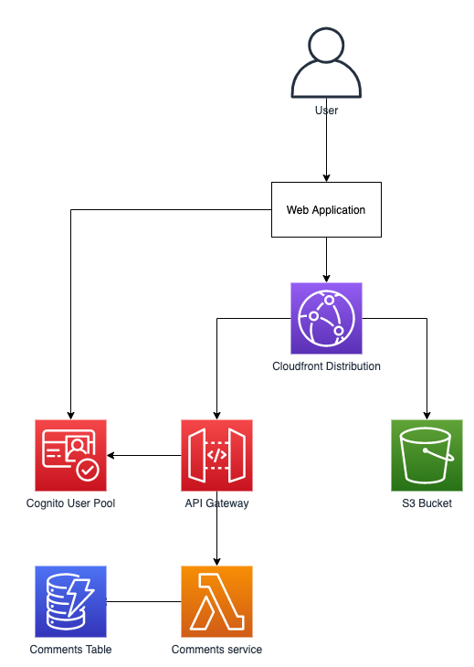

# Welcome to Tech-U CDK training!

This repository conatains code for a sample serverless web application. All that is missing is AWS infrastructure required
to run it on, which is where you come in. Your task is to create a CDK stack containing all resources as per the diagram below.



# Initializing the project

First clone this repository to your local machine:

```
git clone ....
```

Once the repo has been cloned, open terminal in the `iac-training` directory and execute following commands:

```
$ python3 -m venv .venv
$ source .venv/bin/activate
$ pip install -r requirements.txt
```

Make sure that you have valid AWS credentials available by executinig
```
aws sts get-caller-identity
```
Assuming everything worked as expected, you can try to deploy the application by executin ```cdk deploy```. As we haven't defined any resources yet, the application will not provision anything but it will allow to check that everything is working.

# Building the infrastructure

Open visual studio code. In the ```iac-training``` directory execute 
```
$ code .
```
Once the sulution has been opened, open the [application_stack.py](./application/application_stack.py) file and follow the instruction within it.